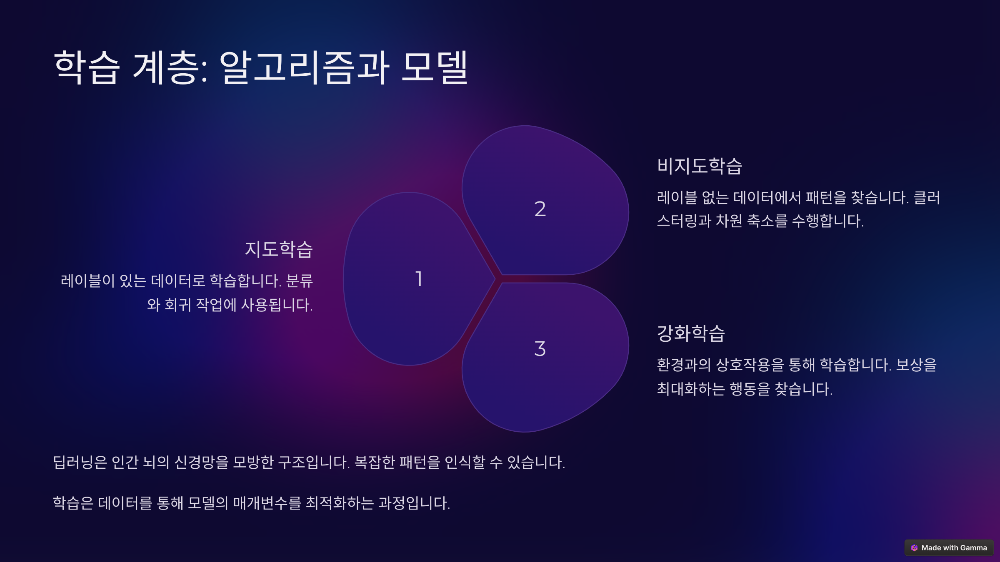
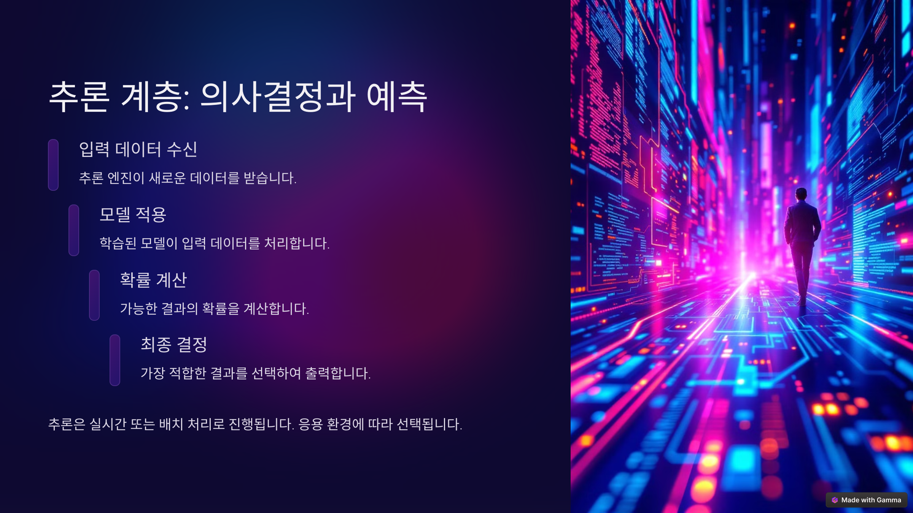
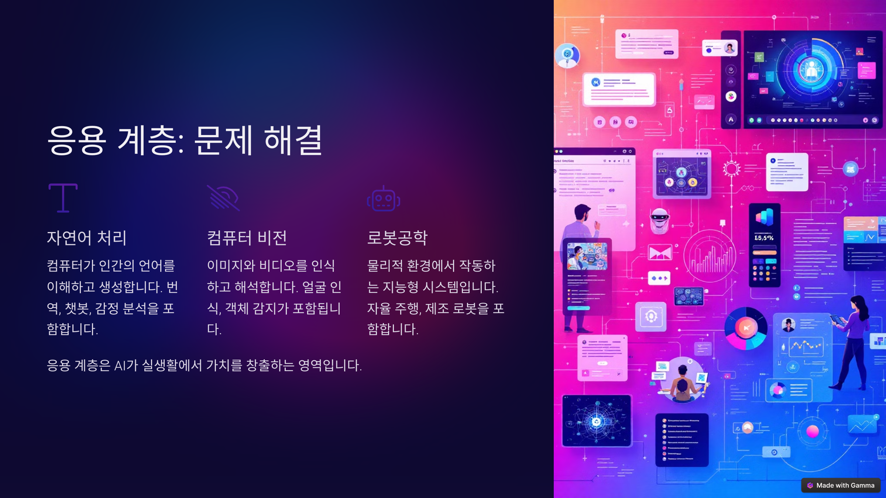
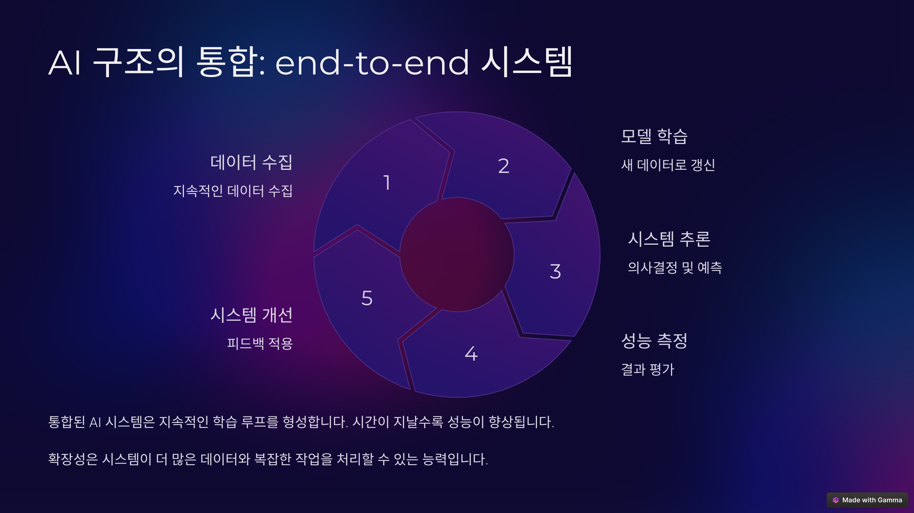

# 1강 고용노동부 직원을 위한 인공지능 알아보기

## 1. 인공지능이란 무엇인가?

### (1) 인공지능의 정의

* 인공지능(AI, Artificial Intelligence)은 인간의 학습, 추론, 문제 해결 능력과 같은 지능적인 기능을 컴퓨터 프로그램으로 구현하여 모방하는 기술입니다.
* 넓은 의미에서는 인간의 지능을 모방하여 컴퓨터가 스스로 학습하고 판단하는 능력을 갖도록 하는 모든 기술을 포함합니다.

### (2) 인공지능의 역사

* **초창기 (1950년대 ~ 1970년대):**
    * 1950년: 앨런 튜링의 '튜링 테스트' 제안으로 인공지능의 가능성이 제시되었습니다.
    * 1956년: 다트머스 회의에서 '인공지능'이라는 용어가 탄생하며 인공지능 연구가 본격적으로 시작되었습니다.
    * 이 시기에는 주로 규칙 기반 시스템과 탐색 알고리즘 연구가 주를 이루었습니다.
* **침체기 (1970년대 ~ 1990년대):**
    * 인공지능 기술의 한계와 기대에 미치지 못하는 성능으로 인해 연구가 침체되었습니다.
    * 전문가 시스템 등 일부 분야에서 제한적인 성공을 거두었지만, 전반적인 발전은 정체되었습니다.
* **부활 (1990년대 ~ 2021년):**
    * 컴퓨터 성능 향상과 데이터 폭증으로 머신러닝과 딥러닝 기술이 급격히 발전했습니다.
    * 이미지 인식, 음성 인식, 자연어 처리 등 다양한 분야에서 놀라운 성과를 달성했습니다.
    * 2016년: 알파고의 이세돌 9단 격파는 인공지능의 가능성을 전 세계에 알리는 중요한 계기가 되었습니다.
* **빅뱅 (2022년 ~ 현재):**
    * 챗GPT를 시작으로 생성형 AI가 발전하면서 인공지능에 대한 관심이 폭발적으로 증가하고 있습니다.
* **인공지능의 미래:**
    * 인공지능은 앞으로 더욱 다양한 분야에서 활용될 것으로 예상됩니다.
    * 윤리적 문제, 일자리 변화 등 사회적 영향에 대한 심도 있는 논의와 대비가 필요한 시점입니다.

### (3) 인공지능 사용의 목적

* 인공지능은 다양한 목적을 위해 활용될 수 있습니다.
* 복잡한 데이터를 분석하여 패턴을 발견하고, 반복적인 작업을 자동화함으로써 인간이 창의적이고 중요한 일에 집중할 수 있도록 돕습니다.
* 질병 진단 및 치료, 개인 맞춤형 교육, 기후 변화 예측, 생산성 향상 등 인류의 삶의 질을 향상시키는 데 기여할 수 있습니다.
* 인간의 언어를 이해하고 소통하는 능력을 바탕으로 인간과 더욱 자연스러운 상호작용을 가능하게 하여, 인간과 협력하는 지능형 시스템을 구축할 수 있습니다.
* 물론 인공지능을 인간의 역할을 완전히 대체하는 용도로 사용하려는 시도도 있을 수 있습니다. 하지만 그러한 방식은 바람직하지 않으며, 장기적으로 지속 가능하지도 않다고 생각합니다.

### (4) 인공지능을 알아야 하는 이유

* **변화의 중심, 노동 시장의 혁신:**
    * 인공지능은 이미 우리 생활 곳곳에 깊숙이 들어와 있으며, 앞으로 더욱 빠른 속도로 사회 전반에 걸쳐 변화를 주도할 것입니다.
    * 노동 시장의 구조를 근본적으로 변화시키고 있으며, 새로운 직업의 등장, 기존 직업의 변화, 자동화로 인한 일자리 감소 등 다양한 변화에 효과적으로 대응해야 합니다.
* **인공지능, 어디까지 알아야 할까?:**
    * 우리는 자동차를 타고 전국 어디든 갈 수 있지만, 자동차를 만드는 모든 기술을 알 필요는 없습니다.
    * 하지만 자동차의 기본적인 작동 원리와 안전 수칙을 이해하고, 운전 기술을 익혀야 안전하고 효율적으로 자동차를 이용할 수 있습니다.
    * 인공지능도 마찬가지입니다. 인공지능 기술을 개발하는 전문가 수준의 지식이 필요한 것은 아니지만, 인공지능의 기본적인 개념과 작동 원리를 이해하고, 인공지능 기술을 활용하는 능력을 갖추는 것이 중요합니다.
    * 인공지능 시대에 필요한 역량을 개발하고 미래를 준비하기 위해서는, 인공지능을 이해하는 것은 이제 선택이 아닌 필수가 되었습니다.

## 2. 인공지능 핵심 개념 이해하기

### (1) 인공지능, 머신러닝, 딥러닝

* **인공지능(AI, Artificial Intelligence):**
    * 인간의 지능을 모방하여 컴퓨터가 스스로 학습하고 판단하는 능력을 갖도록 하는 모든 기술을 포괄하는 넓은 개념입니다.
    * 문제 해결, 추론, 학습, 인지 등 인간의 지능적인 행동을 컴퓨터로 구현하는 것을 목표로 합니다.
* **머신러닝(ML, Machine Learning):**
    * 인공지능의 하위 분야로, 컴퓨터가 명시적인 프로그래밍 없이 데이터를 통해 스스로 학습하고 성능을 향상시키는 기술입니다.
    * 데이터에서 패턴을 찾아 예측하거나 의사 결정을 내리는 데 사용됩니다.
* **딥러닝(DL, Deep Learning):**
    * 머신러닝의 하위 분야로, 심층 신경망(Deep Neural Network)을 사용하여 복잡한 패턴을 인식하고 학습하는 기술입니다.
    * 이미지 인식, 음성 인식, 자연어 처리 등 복잡한 문제를 해결하는 데 뛰어난 성능을 보입니다.
    * **LLM(대규모 언어 모델)** 은 딥러닝 기반으로 자연어 처리 분야에서 뛰어난 성능을 보이는 모델입니다.

### (2) 핵심 개념 설명

* **데이터(Data):**
    * 인공지능 모델이 학습하고 추론하는 데 사용되는 정보의 집합입니다.
    * 인공지능 모델의 성능은 학습 데이터의 양과 질에 크게 의존합니다.
* **알고리즘(Algorithm):**
    * 문제를 해결하거나 특정 작업을 수행하기 위한 일련의 규칙 또는 절차입니다.
    * 인공지능 모델은 다양한 알고리즘을 사용하여 데이터를 처리하고 학습합니다.
* **학습(Learning):**
    * 데이터를 통해 패턴을 인식하고 지식을 습득하는 과정입니다.
    * 머신러닝 모델은 학습 데이터를 통해 스스로 규칙을 만들고 성능을 향상시킵니다.
* **모델(Model):**
    * 데이터에서 학습된 패턴이나 규칙을 표현하는 수학적 또는 논리적 구조입니다.
    * 학습된 모델은 새로운 데이터에 대한 예측이나 판단을 수행하는 데 사용됩니다.
* **패턴(Pattern):**
    * 데이터에서 발견되는 규칙적인 특징 또는 관계입니다.
    * 인공지능 모델은 데이터에서 패턴을 학습하여 예측 또는 의사 결정을 수행합니다.
* **추론(Inference):**
    * 학습된 모델을 사용하여 새로운 데이터에 대한 예측이나 판단을 내리는 과정입니다.
    * 학습된 지식을 바탕으로 새로운 상황에 대한 결과를 예측합니다.
* **최적화(Optimization):**
    * 모델의 성능을 최대화하거나 오류를 최소화하기 위한 과정입니다.
    * 최적화 알고리즘은 모델의 학습 과정에서 중요한 역할을 합니다.
* **문제 해결(Problem Solving):**
    * 주어진 문제에 대한 해결책을 찾는 과정입니다.
    * 인공지능은 다양한 알고리즘과 모델을 활용하여 복잡한 문제를 해결합니다.
* **자연어 처리(NLP, Natural Language Processing):**
    * 컴퓨터가 인간의 언어를 이해하고 처리하도록 하는 기술입니다.
    * 텍스트 분석, 번역, 질의응답 등 다양한 분야에서 활용됩니다.

### (3) 주요 학습 방식

* **지도 학습(Supervised Learning):**
    * 정답(레이블)이 있는 학습 데이터를 사용하여 모델을 학습시키는 방식입니다.
    * 분류, 회귀 등 예측 문제를 해결하는 데 사용됩니다.
* **비지도 학습(Unsupervised Learning):**
    * 정답(레이블)이 없는 학습 데이터를 사용하여 데이터의 숨겨진 패턴이나 구조를 찾는 방식입니다.
    * 군집화, 차원 축소 등 데이터 탐색 및 분석에 사용됩니다.
* **강화 학습(Reinforcement Learning):**
    * 에이전트가 환경과 상호작용하며 보상을 최대화하는 방향으로 학습하는 방식입니다.
    * 게임, 로봇 제어 등 의사 결정 문제를 해결하는 데 사용됩니다.

### (4) 개념 간 관계 요약

* 데이터는 알고리즘을 통해 학습되어 모델을 구축하는 데 사용됩니다.
* 모델은 학습된 데이터를 기반으로 패턴을 인식하고 추론을 수행합니다.
* 문제 해결은 다양한 알고리즘과 모델을 활용하여 수행됩니다.
* 최적화는 학습과정을 통해 모델의 성능을 향상 시키는 역할을 합니다.

### (5) 세부적인 인공지능 알고리즘

* **CNN(Convolutional Neural Network):**
    * 이미지 인식, 비디오 분석 등 시각적 데이터를 처리하는 데 특화된 딥러닝 모델입니다.
* **RNN(Recurrent Neural Network):**
    * 시계열 데이터, 자연어 처리 등 순차적인 데이터를 처리하는 데 특화된 딥러닝 모델입니다.
* **Transformer:**
    * 자연어 처리, 음성 인식 등 다양한 분야에서 뛰어난 성능을 보이는 딥러닝 모델입니다. LLM의 기반이 되는 기술입니다.
* **Decision Tree(결정 트리):**
    * 데이터의 특징을 기반으로 의사 결정 규칙을 나무 구조로 표현하는 모델입니다.
* **Random Forest:**
    * 여러 개의 결정 트리(Decision Tree)를 결합하여 예측 성능을 높이는 앙상블 학습 모델입니다.
* **GAN(Generative Adversarial Network):**
    * 생성 모델과 판별 모델을 경쟁적으로 학습시켜 실제와 유사한 새로운 데이터를 생성하는 딥러닝 모델입니다.
* **Naive Bayes(나이브 베이즈):**
    * 확률 기반의 분류 알고리즘으로, 텍스트 분류, 스팸 메일 필터링 등에 사용됩니다.
* **SVM(Support Vector Machine):**
    * 분류 및 회귀 문제를 해결하는 데 사용되는 강력한 지도 학습 모델입니다.
* **K-means Clustering:**
    * 데이터를 k개의 클러스터로 그룹화하는 비지도 학습 알고리즘입니다.
* **PCA(Principal Component Analysis):**
    * 데이터의 차원을 축소하여 시각화하거나 분석하기 쉽게 만드는 비지도 학습 알고리즘입니다.

## 3. 인공지능 서비스의 구조

### 3-1. 데이터 계층: AI의 기반

- 데이터 품질은 AI 성능에 직접적인 영향을 미칩니다. 데이터 품질이 높을수록 원하는 결과를 얻을 확률도 높아집니다.
- Garbage In Garbage Out

#### 3-1-1. 데이터 수집

- 다양한 소스에서 원시 데이터를 수집합니다.
- 센서, 웹 크롤링, 사용자 상호작용 등이 포함됩니다.

#### 3-1-2. 데이터 정제

- 불완전하거나 부정확한 데이터를 제거합니다.
- 일관성과 신뢰성을 확보합니다.

#### 3-1-3. 데이터 변환

- AI 모델이 이해할 수 있는 형식으로 데이터를 변환합니다.
- 특성 추출도 포함됩니다.
 
### 3-2. 학습 계층: 알고리즘과 모델

#### 3-2-1. 지도 학습(Supervised Learning)

- 레이블이 있는 데이터로 학습합니다.
- 주로 분류, 회귀 작업에 사용됩니다.

#### 3-2-2. 비지도 학습(Unsupervised Learning)

- 레이블 없는 데이터에서 패턴을 찾습니다.
- 클러스터링과 차원 축소를 시행합니다.

#### 3-2-3. 강화 학습(Reinforce Learning)

- 환경과의 상호작용을 통해 학습합니다.
- 보상을 최대화하는 행동을 찾습니다.

### 3-3. 추론 계층: 의사결정과 예측

- **머신러닝 모델**에는 선형 회귀, 로지스틱 회귀, 결정 트리, 랜덤 포레스트, 나이브 베이즈, SVM(Support Vector Machine), K-means Clustering, PCA(Principal Component Analysis) 등이 있습니다.

- **딥러닝 모델**에는 CNN(Convolutional Neural Network), RNN(Recurrent Neural Network), LSTM(Long Short-Term Memory), Transformer, GAN(생성적 적대 신경망), LLM(Large Language Model) 등이 있습니다.

### 3-4. 응용 계층: 문제 해결

### 3-5. AI 기반 시스템의 구조

## 4. 최근 인공지능 서비스 현황

- ChatGPT 이후 정말 수많은 AI 서비스들이 쏟아지고 있습니다. 그 중에 몇가지만 소개드립니다.

## 5. 인공지능 서비스 어떻게 만들고 사용해야 할까?

- 인공지능 기술을 단순하게 표현하면 과거의 데이터로부터 확률 패턴을 찾아서, 현재의 문제에 적용해보는 것입니다.
- 과거의 데이터로부터 확률 패턴을 찾는 기술이기 때문에 2가지 한계가 존재합니다.
  - 첫째, 과거의 데이터로부터 학습하기 때문에 새로운 문제에 대해서는 적절한 답을 제안하기 어렵습니다.
  - 둘째, 확률 패턴을 찾아서 답변하는 것이기 때문에 답변을 100% 신뢰할 수 없습니다.
- 인공지능을 활용한 서비스를 만들어 보고 싶다면, 다음의 사항들을 유의해야 합니다.
- 첫째, 신뢰할 수 있는 학습 데이터를 충분히 확보해야 합니다.
  - 인공지능 서비스는 데이터를 학습하는 것부터 시작하는데, 만약 데이터가 신뢰할 수 없는 내용이라면 서비스 품질을 확보하는 것은 불가능합니다.
  - 데이터가 학습하기 어려운 형태를 가지고 있다면, 학습에 용이하도록 데이터를 가공해 주어야 합니다.
- 둘째, 다양한 모델이 경쟁할 수 있도록 해야 합니다.
  - 인공지능 서비스를 제공할 수 있는 방법은 하나가 아닙니다. 각기 다른 알고리즘을 사용하는 모델을 사용하여 여러가지 방식으로 서비스를 제공할 수 있습니다.
  - 이러한, 경쟁 과정을 통해 주어진 문제를 보다 적절히 해결할 수 있는 모델을 찾아가는 과정 역시 매우 중요합니다.
  - 그리고, 그 경쟁에는 인공지능을 사용하지 않는 모델도 포함하는 것이 좋습니다.
- 셋째, 인공지능의 의사결정을 믿지 말고, 여러가지 제약을 두어 신뢰할 수 있는 서비스를 설계해야 합니다.
  - 노동법에 대한 인공지능 서비스를 제공하고 싶다면, 답변은 기존 질의회시나 판례를 찾아주는 수준에서 멈추는 것도 하나의 방법입니다. 더 나아가 답변을 생성하고 싶다면 전문가가 답변을 검토할 수 있는 체계를 갖추어야 합니다.
  - 가장 일반적인 방법 중의 하나는 우리 직원들에게 추천을 하는 방식입니다. 이 때에도 하나만 추천하기보다 다양한 옵션을 주고, 그 중에서 선택을 하도록 하는 것이 필요합니다. 다소 불편하더라도 서비스의 신뢰성을 확보하는 것은 중요합니다.
- 넷째, 인공지능 서비스는 피드백을 통해 반복적으로 개선될 수 있어야 합니다. 기존 결과를 평가하여 개선될 수 없는 인공지능 서비스는 지속될 수 없습니다.
  - 서비스를 제공하는 것도 중요하지만, 제공된 서비스를 추적하는 것도 그만큼 중요합니다.
