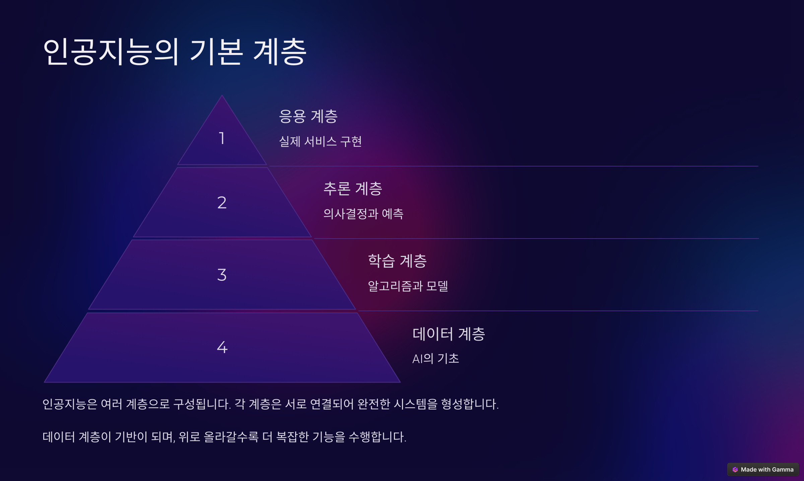
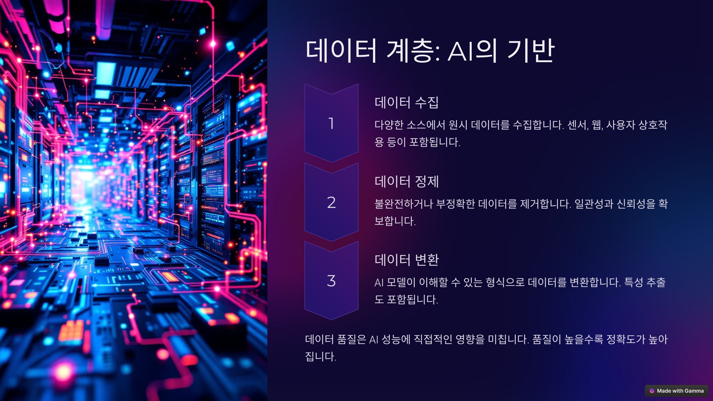

# 1강 인공지능의 개념과 최근 서비스 현황

## 1. 인공지능의 정의

- 인공지능(AI, Artificial Intelligence)은 인간의 학습, 추론, 문제 해결 능력을 컴퓨터가 모방하도록 하는 기술
- 즉, 기계가 데이터를 분석하고 학습하여 스스로 결정을 내릴 수 있도록 하는 시스템

## 2. 핵심 개념

- 학습(learning): 데이터를 이용해 패턴을 찾고 개선하는 과정
- 추론(reasoning): 기존 정보를 바탕으로 새로운 결론을 도출하는 과정
- 문제 해결(problem-solving): 목표를 달성하기 위한 최적의 방법을 찾는 과정

## 3. 인공지능 서비스의 구조

### 3-1. 데이터 계층: AI의 기반

- 데이터 품질은 AI 성능에 직접적인 영향을 미칩니다. 데이터 품질이 높을수록 원하는 결과를 얻을 확률도 높아집니다.
- Garbage In Garbage Out

#### 3-1-1. 데이터 수집

- 다양한 소스에서 원시 데이터를 수집합니다.
- 센서, 웹 크롤링, 사용자 상호작용 등이 포함됩니다.

#### 3-1-2. 데이터 정제

- 불완전하거나 부정확한 데이터를 제거합니다.
- 일관성과 신뢰성을 확보합니다.

#### 3-1-3. 데이터 변환

- AI 모델이 이해할 수 있는 형식으로 데이터를 변환합니다.
- 특성 추출도 포함됩니다.
 
### 3-2. 학습 계층: 알고리즘과 모델

### 인공지능의 유형

- 인공지능은 다양한 기준으로 유형을 나눌 수 있는데, 주로 능력과 학습방식에 따라 분류합니다.
  - 능력에 따른 분류: 약 인공지능, 강 인공지능
  - 학습 방식에 따른 분류: 머신러닝, 딥러닝, 생성형 AI
 
- 머신러닝(Machine Learning)
  - 명시적인 프로그래밍 없이 컴퓨터가 데이터로부터 학습할 수 있도록 하는 문제해결방식입니다.
  - 대표적인 예로 선형회귀, 의사결정트리, 서포트벡터머신 등이 있습니다.
 
- 딥러닝(Deep Learning)
  - 딥러닝은 머신러닝의 한 분야입니다.
  - 딥러닝은 심층신경망(Deep Neural Network)를 사용하여 문제를 해결합니다.
  - 머신러닝의 경우 사람이 직접 데이터의 특징을 추출하고 입력해야 하지만, 딥러닝은 심층신경망이 데이터로부터 자동으로 특징을 추출하고 학습합니다.
 
- 생성형 AI(Generative AI)
  - 딥러닝 기술을 기반으로 작동하며, 생성적 적대 신경망(GANs; Generative Adversarial Networks), 트랜스포머(Transformers), 확산모델(Diffusion Models) 등의 알고리즘을 사용합니다.
  - 생성형 AI는 통계적 확률을 기반으로 새로운 콘텐츠를 생성하는 인공지능이기 때문에 사실이 아닌 것을 사실처럼 이야기하는 환각(Hallucination) 현상이 발생할 수 있습니다.
 
### 머신러닝 예제: 스팸메일 분류하기

- https://github.com/Leekhoo/Spam-Mail-Classification-Project/blob/main/spam%20mail.ipynb

### 딥러닝 예제: MNIST 분류하기

### 생성형 AI: PDF 읽고 답하기

- https://brunch.co.kr/@topasvga/3868

## 최근 인공지능 서비스 현황

- ChatGPT 이후 정말 수많은 AI 서비스들이 쏟아지고 있습니다. 그 중에 몇가지만 소개드립니다.

- LLM 기반의 생성형 AI 서비스: OpenAI의 ChatGPT, Microsoft의 Copilot, Anthropic의 Claude, Google의 Gemini, Monica의 Manus, 
