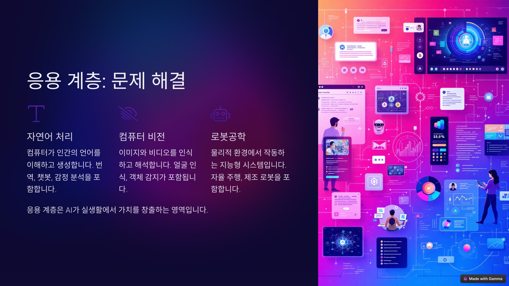
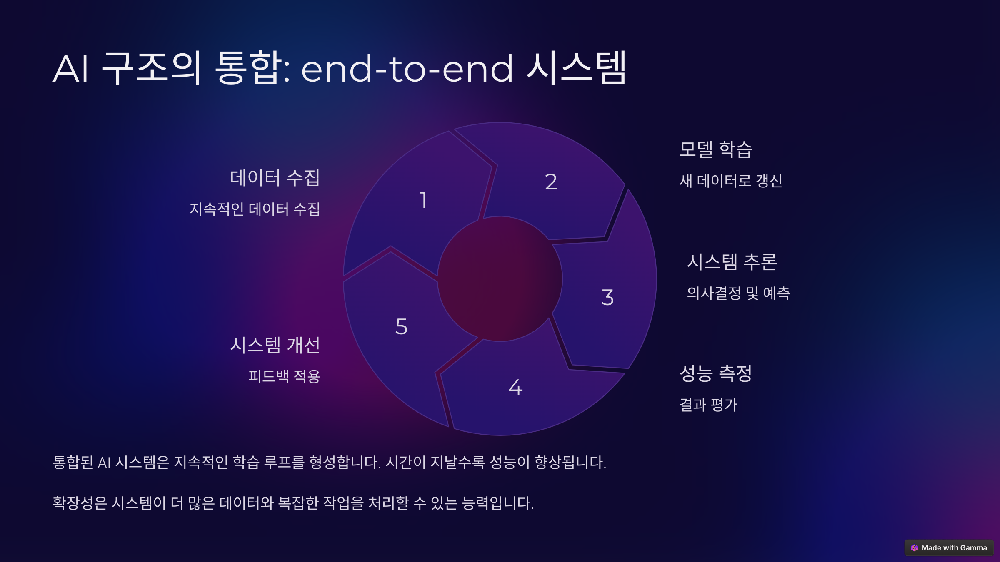

# 1강 고용노동부 직원을 위한 인공지능 알아보기

## 1. 인공지능이란 무엇인가?

### (1) 인공지능의 정의

- 인공지능(AI, Artificial Intelligence)은 인간의 학습, 추론, 문제 해결 능력과 같은 지능적인 기능을 컴퓨터 프로그램으로 구현하여 모방하는 기술입니다.
- 넓은 의미에서는 인간의 지능을 모방하여 컴퓨터가 스스로 학습하고 판단하는 능력을 갖도록 하는 모든 기술을 포함합니다.

* **인공지능, 어디까지 알아야 할까?:**
    * 우리는 자동차를 타고 전국 어디든 갈 수 있지만, 자동차를 만들기 위해 필요한 모든 기술을 알 필요는 없습니다.
    * 하지만 자동차의 기본적인 작동 원리와 안전 수칙을 이해하고, 운전 기술을 익혀야 안전하고 효율적으로 자동차를 이용할 수 있습니다.
    * 인공지능도 마찬가지입니다. 인공지능 기술을 개발하는 전문가 수준의 지식이 필요한 것은 아니지만, 인공지능의 기본적인 개념과 작동 원리를 이해하고, 인공지능 기술을 활용하는 능력을 갖추는 것이 중요합니다.
    * 인공지능 시대에 필요한 역량을 개발하고 미래를 준비하기 위해서는, 인공지능을 이해하는 것은 이제 선택이 아닌 필수가 되었습니다.
 
### (2) 인공지능, 머신러닝, 딥러닝

* **인공지능(AI, Artificial Intelligence):**
    * 인간의 지능을 모방하여 컴퓨터가 스스로 학습하고 판단하는 능력을 갖도록 하는 모든 기술을 포괄하는 넓은 개념입니다.
    * 문제 해결, 추론, 학습, 인지 등 인간의 지능적인 행동을 컴퓨터로 구현하는 것을 목표로 합니다.
* **머신러닝(ML, Machine Learning):**
    * 인공지능의 하위 분야로, 컴퓨터가 명시적인 프로그래밍 없이 데이터를 통해 스스로 학습하고 성능을 향상시키는 기술입니다.
    * 데이터에서 패턴을 찾아 예측하거나 의사 결정을 내리는 데 사용됩니다.
* **딥러닝(DL, Deep Learning):**
    * 머신러닝의 하위 분야로, 심층 신경망(Deep Neural Network)을 사용하여 복잡한 패턴을 인식하고 학습하는 기술입니다.
    * 이미지 인식, 음성 인식, 자연어 처리 등 복잡한 문제를 해결하는 데 뛰어난 성능을 보입니다.
    * **LLM(대규모 언어 모델)** 은 딥러닝 기반으로 자연어 처리 분야에서 뛰어난 성능을 보이는 모델입니다.
 
### (3) **인공지능, 어디까지 알아야 할까?:**
    * 우리는 자동차를 타고 전국 어디든 갈 수 있지만, 자동차를 만드는 모든 기술을 알 필요는 없습니다.
    * 하지만 자동차의 기본적인 작동 원리와 안전 수칙을 이해하고, 운전 기술을 익혀야 안전하고 효율적으로 자동차를 이용할 수 있습니다.
    * 인공지능도 마찬가지입니다. 인공지능 기술을 개발하는 전문가 수준의 지식이 필요한 것은 아니지만, 인공지능의 기본적인 개념과 작동 원리를 이해하고, 인공지능 기술을 활용하는 능력을 갖추는 것이 중요합니다.
    * 인공지능 시대에 필요한 역량을 개발하고 미래를 준비하기 위해서는, 인공지능을 이해하는 것은 이제 선택이 아닌 필수가 되었습니다.

### (4) 인공지능의 작동방식

- 인공지능은 어떻게 인간의 지능을 모방할까요?
- 일부의 예외가 있을 수 있지만, 대부분의 경우 인공지능은 다음과 같은 구조를 가지고 있습니다.

- 데이터를 학습하고, 학습한 결과를 바탕으로 추론하고, 추론한 결과로 서비스를 구현합니다.
- 즉, 인공지능은 **데이터 → 학습 → 추론 → 응용** 단계를 통해 인간의 지능을 모방합니다.

## 2. 인공지능의 구조

### (1) 인공지능의 시작: 데이터

- 데이터가 없다면 인공지능도 없습니다.
* **데이터(Data):**
    * 인공지능 모델이 학습하고 추론하는 데 사용되는 정보의 집합입니다.
    * 인공지능 모델의 성능은 학습 데이터의 양과 질에 크게 의존합니다.

- 데이터 품질은 AI 성능에 직접적인 영향을 미칩니다. 데이터 품질이 높을수록 원하는 결과를 얻을 확률도 높아집니다.
- 아무리 좋은 알고리즘을 사용해도, 쓰레기가 들어가면 쓰레기가 나옵니다.(Garbage In, Garbage Out)

#### ① 데이터 수집

- 다양한 소스에서 원시 데이터(raw data)를 수집합니다.
- 센서, 웹 크롤링, 사용자 상호작용 등이 포함됩니다.
  - 센서를 활용해서 데이터를 수집하면 굉장히 많은 양의 데이터를 수집할 수 있습니다. 다만, 맥락이 없이 기계적으로 수집된 데이터는 활용 가치가 떨어질 수 있습니다.
  - 웹 크롤링은 인터넷 상에 존재하는 데이터를 수집하는 기술입니다. 특정한 조건을 충족하는 데이터들을 수집할 수 있으나, 데이터의 신뢰성을 확인할 수 없고 데이터가 편중될 수 있다는 문제가 있습니다.
  - 사용자 상호작용은 사람이 컴퓨터에 입력하는 데이터를 수집하는 것을 의미합니다. 키보드를 통한 입력 정보를 기본으로 수집하지만, 마우스나 터치를 통한 입력도 수집대상이 됩니다. 사람이 하는 어떤 행동이라도 수집의 대상이 될 수 있습니다.
  - 가장 신뢰할 수 있고 의미가 있는 데이터는 돈을 주고받는 과정에서 생산되는 데이터입니다. 
- 데이터는 많으면 많을수록 좋습니다.

#### ② 데이터 정제

- 데이터 정제(Cleaning)는 지저분한 데이터를 깔끔하게 만드는 과정입니다.

- 데이터가 지저분하다는 것은 어떤 의미일까요?
- 불완전한 데이터, 부정확한 데이터, 분류되지 않는 데이터, 편중된 데이터를 의미합니다.
  - 데이터가 불완전하다는 것은 일부 항목이 빠져있거나, 의미없는 값이 포함되어 있다는 것을 의미합니다.
  - 데이터가 부정확하다는 것은 논리적으로 모순된 데이터를 의미합니다.
  - 분류체계 없이 그때그때 입력한 데이터는 수집하더라도 활용하기가 어렵습니다.
  - 데이터가 편중된다는 것은 일부만을 과도하게 대표하는 데이터를 의미합니다.

- 데이터가 아무리 많아도, 지저분한 데이터에 불과하다면 학습을 하더라도 좋은 추론을 할 수 없습니다. 우리는 깔끔한 데이터가 필요합니다.

- 좋은 전산시스템은 깔끔한 데이터를 생산합니다. 시스템 그 자체가 하나의 훌륭한 데이터 원천으로 작동합니다.

#### ③ 데이터 변환

- 데이터 변환(Transformation)은 정제된 데이터를 인공지능 모델이 학습하기에 적합한 형태로 가공하는 과정입니다. 단순히 데이터를 깨끗하게 만드는 것을 넘어, 모델의 성능 향상에 직접적인 영향을 미치는 중요한 단계입니다.

- 왜 데이터를 변환해야 할까요?

  - 모델의 이해도 향상: 인공지능 모델은 종종 특정 형태의 입력 데이터를 선호합니다. 예를 들어, 이미지 처리 모델은 픽셀 값을 0과 1 사이의 값으로 정규화된 데이터를 더 잘 학습할 수 있습니다. 텍스트 처리 모델은 단어를 숫자 벡터로 변환해야 문맥을 이해할 수 있습니다.

  - 특성(Feature) 추출 및 생성: 원시 데이터에는 모델 학습에 직접적으로 유용하지 않은 정보가 포함될 수 있습니다. 데이터 변환 과정에서 유용한 특성을 추출하거나, 기존 특성을 조합하여 새로운 특성을 생성할 수 있습니다. 예를 들어, 고객의 구매 내역 데이터에서 '총 구매 금액', '평균 구매 빈도' 등의 새로운 특성을 만들어낼 수 있습니다. 이러한 특성은 모델이 패턴을 더 잘 파악하고 정확한 예측을 하는 데 도움을 줍니다.

  - 데이터 차원 축소: 데이터의 특성 수가 너무 많으면 모델 학습에 어려움이 발생하고 과적합(Overfitting)의 위험이 높아질 수 있습니다. 데이터 변환 기술 중 하나인 차원 축소는 데이터의 중요한 정보를 유지하면서 특성의 수를 줄여 모델의 효율성을 높입니다.

  - 데이터 통합: 서로 다른 형식이나 구조를 가진 여러 데이터 소스를 하나의 일관된 형태로 통합하는 것도 데이터 변환의 중요한 측면입니다. 예를 들어, 고객 정보는 CRM 시스템에, 구매 정보는 결제 시스템에 분산되어 있을 수 있습니다. 이러한 데이터를 통합하여 모델 학습에 활용하면 더욱 풍부하고 정확한 분석이 가능해집니다.

- 데이터 변환의 예시

  - 정규화(Normalization) 및 표준화(Standardization): 데이터의 값 범위를 특정 범위(예: 0~1)로 조정하거나, 평균을 0, 표준편차를 1로 만드는 작업입니다. 이는 모델 학습 속도를 높이고 특정 특성에 모델이 과도하게 집중하는 것을 방지합니다.

  - 범주형 데이터 인코딩(Categorical Data Encoding): 텍스트 형태의 범주형 데이터(예: '빨강', '파랑', '노랑')를 모델이 이해할 수 있는 숫자 형태로 변환하는 작업입니다. 원-핫 인코딩(One-Hot Encoding)이나 레이블 인코딩(Label Encoding) 등이 대표적인 방법입니다.

  - 텍스트 데이터 토큰화(Text Data Tokenization): 텍스트 데이터를 단어나 구와 같은 의미 있는 단위로 나누는 작업입니다. 이는 자연어 처리 모델의 기본적인 전처리 과정입니다.

  - 특성 스케일링(Feature Scaling): 특성들의 값 범위를 비슷하게 조정하여 모델 학습 시 특정 특성이 다른 특성에 비해 과도한 영향을 미치는 것을 방지합니다.

- 데이터 변환은 단순히 기술적인 작업을 넘어, 문제 해결의 목표와 데이터의 특성을 깊이 이해하는 과정입니다. 적절한 데이터 변환 전략은 인공지능 모델의 성능을 극대화하는 핵심 요소입니다.

### (2) 데이터를 모았으면: 학습을 해야지

#### ① 지도 학습 (Supervised Learning)

- 지도 학습은 정답(레이블)이 있는 데이터를 사용하여 모델을 학습시키는 방식입니다. 마치 선생님이 정답을 알려주면서 학생을 가르치는 것과 비슷하다고 생각하시면 됩니다.

  - **분류 (Classification) 모델**: 입력된 데이터를 미리 정의된 여러 개의 범주(클래스) 중 하나로 분류하는 모델입니다.
    - 로지스틱 회귀 (Logistic Regression): 주로 이진 분류 (예/아니오) 문제에 사용됩니다. 예를 들어, 사업장 데이터를 기반으로 '임금체불 발생' 또는 '미발생'을 예측하는 데 사용될 수 있습니다.
    - 서포트 벡터 머신 (Support Vector Machine, SVM): 데이터를 여러 클래스로 나누는 최적의 경계를 찾는 모델입니다.
    - 결정 트리 (Decision Tree): 데이터를 특정 기준에 따라 분기하면서 분류하는 모델입니다. 마치 '스무고개' 게임과 비슷하게 생각할 수 있습니다.
    - 랜덤 포레스트 (Random Forest): 여러 개의 결정 트리를 앙상블하여 예측 성능을 높이는 모델입니다.
    - 나이브 베이즈 (Naive Bayes): 확률 기반의 분류 모델로, 텍스트 분류 등에 많이 사용됩니다.
    - 신경망 (Neural Network) / 딥러닝 (Deep Learning) 모델 (예: CNN, RNN): 복잡한 패턴을 학습하는 데 강력한 성능을 보이는 모델입니다. 이미지 분류 (CNN), 자연어 처리 (RNN) 등에 활용됩니다.

  - **회귀 (Regression) 모델**: 입력된 데이터에 대해 연속적인 숫자 값을 예측하는 모델입니다. 예를 들어, 사업장의 여러 특성을 기반으로 '매출액'을 예측하는 데 사용될 수 있습니다.
    - 선형 회귀 (Linear Regression): 데이터의 경향성을 가장 잘 나타내는 직선을 찾아 예측하는 기본적인 회귀 모델입니다.
    - 다항 회귀 (Polynomial Regression): 데이터의 경향성이 곡선 형태일 때 사용되는 회귀 모델입니다.
    - 릿지 회귀 (Ridge Regression), 라쏘 회귀 (Lasso Regression): 선형 회귀 모델의 과적합 문제를 해결하기 위해 규제를 추가한 모델입니다.
    - 결정 트리 회귀 (Decision Tree Regression), 랜덤 포레스트 회귀 (Random Forest Regression): 결정 트리 기반의 회귀 모델입니다.
    - 신경망 (Neural Network) / 딥러닝 (Deep Learning) 모델 (예: MLP): 복잡한 비선형 관계를 학습하여 연속적인 값을 예측하는 데 사용됩니다.

#### ② 비지도 학습 (Unsupervised Learning)

- 비지도 학습은 정답(레이블)이 없는 데이터를 사용하여 모델 스스로 데이터의 패턴이나 구조를 학습하는 방식입니다. 마치 탐험가가 아무런 지도 없이 새로운 지역을 탐험하는 것에 비유할 수 있습니다.

  - **군집화 (Clustering) 모델**: 비슷한 특성을 가진 데이터끼리 그룹(클러스터)으로 묶는 모델입니다. 예를 들어, 고객 데이터를 분석하여 비슷한 구매 패턴을 가진 고객 그룹을 찾을 수 있습니다.
    - K-평균 (K-Means) 클러스터링: 데이터를 미리 정해진 K개의 클러스터로 나누는 알고리즘입니다.
    - 계층적 클러스터링 (Hierarchical Clustering): 데이터 간의 유사성을 기반으로 계층적인 클러스터 구조를 만드는 알고리즘입니다.
    - DBSCAN: 밀도 기반의 클러스터링 알고리즘으로, 밀도가 높은 지역을 클러스터로 인식합니다.
  - **차원 축소 (Dimensionality Reduction) 모델**: 데이터의 중요한 정보를 유지하면서 데이터의 특성(변수) 개수를 줄이는 모델입니다. 고차원 데이터를 시각화하거나 모델 학습 속도를 높이는 데 유용합니다.
    - 주성분 분석 (Principal Component Analysis, PCA): 데이터의 분산을 가장 잘 설명하는 주성분을 찾아 차원을 축소하는 방법입니다.
    - t-SNE (t-distributed Stochastic Neighbor Embedding): 고차원 데이터를 2차원 또는 3차원으로 시각화하는 데 주로 사용되는 알고리즘입니다.
  - **연관 규칙 학습 (Association Rule Learning) 모델**: 데이터에서 함께 자주 발생하는 항목 간의 규칙을 찾는 모델입니다. 예를 들어, 쇼핑몰 구매 데이터에서 '기저귀를 사는 고객은 분유도 함께 산다'와 같은 규칙을 발견할 수 있습니다.
    - Apriori 알고리즘, FP-Growth 알고리즘: 대표적인 연관 규칙 학습 알고리즘입니다.

#### ③ 강화 학습 (Reinforcement Learning)

- 강화 학습은 보상을 통해 모델이 최적의 행동 방식을 스스로 학습하도록 하는 방식입니다. 마치 강아지에게 훈련사가 원하는 행동을 했을 때 간식을 주는 것과 비슷합니다.
  - Q-러닝 (Q-Learning): 각 상태에서 가능한 행동의 가치(Q-값)를 학습하여 최적의 정책을 찾는 알고리즘입니다.
  - SARSA (State-Action-Reward-State-Action): 현재 상태에서의 행동과 다음 상태에서의 행동을 고려하여 정책을 학습하는 알고리즘입니다.
  - 심층 강화 학습 (Deep Reinforcement Learning, DRL) 모델 (예: DQN, A3C): 신경망과 강화 학습을 결합하여 복잡한 환경에서 스스로 학습하는 모델입니다. 게임, 로봇 제어, 자율 주행 등에 활용됩니다.
 
### ③ 추론 계층: 의사결정과 예측

- 알고리즘과 모델을 정하고, 학습까지 완료되었다면 인공지능을 활용한 의사결정, 즉 추론(예측)을 해볼 수 있습니다.
- 인공지능의 추론 결과를 의사결정에 어떻게 활용할지에 대해서도 고민이 필요합니다.
  - 인공지능의 추론은 사람의 의사결정과 비슷합니다. 그게 맞는 것인지 틀린 것인지 정확히 알 수 없습니다. 과거의 데이터에 의존하여 확률을 제시해 줄 뿐입니다.
- 그렇기 때문에 대부분의 인공지능의 추론 결과를 바로 사용하기보다, 여러 추천 제안의 일부로 포함하거나 인간이 정하기 전에 참고할 수 있는 자료로 제공하는 자료로 사용합니다.
  - 필요에 따라 추론 결과의 형식을 제한하기도 합니다.
 
### ④ 응용 계층: 문제 해결

- 추론 결과를 가지고 어떤 서비스를 제공할 것인지까지 결정하면, 서비스 시작 단계까지 왔다는 것을 의미합니다.
- 사람들이 필요로 하는 서비스를 제공하고, 그 결과가 사람들의 기대를 충족시킨다면 서비스가 유지되고, 좋은 성과를 낼 수 있을 것입니다.
- 하지만, 초기 사용자들에게 좋은 평가를 받지 못한다면 서비스가 지속되기 어려울 수도 있습니다.

- 인공지능 서비스가 좋은 성과를 내려면 인공지능 시스템의 구조와 특징을 이해해야 합니다.
  - 좋은 인공지능 서비스는 end-to-end 서비스를 제공하며, 지속적인 학습이 가능해야 합니다.
  - 지속적인 학습이 가능하지 않은 인공지능 서비스, 나아가 전산시스템은 도태될 수 밖에 없습니다.

## 3. 인공지능 사용의 목적

* 인공지능은 다양한 목적을 위해 활용될 수 있습니다.
* 복잡한 데이터를 분석하여 패턴을 발견하고, 반복적인 작업을 자동화함으로써 인간이 창의적이고 중요한 일에 집중할 수 있도록 돕습니다.
* 질병 진단 및 치료, 개인 맞춤형 교육, 기후 변화 예측, 생산성 향상 등 인류의 삶의 질을 향상시키는 데 기여할 수 있습니다.
* 인간의 언어를 이해하고 소통하는 능력을 바탕으로 인간과 더욱 자연스러운 상호작용을 가능하게 하여, 인간과 협력하는 지능형 시스템을 구축할 수 있습니다.
* 물론 인공지능을 인간의 역할을 완전히 대체하는 용도로 사용하려는 시도도 있을 수 있습니다. 하지만 그러한 방식은 바람직하지 않으며, 장기적으로 지속 가능하지도 않다고 생각합니다.

## 4. 인공지능 관련 용어

* **데이터(Data):**
    * 인공지능 모델이 학습하고 추론하는 데 사용되는 정보의 집합입니다.
    * 인공지능 모델의 성능은 학습 데이터의 양과 질에 크게 의존합니다.
* **알고리즘(Algorithm):**
    * 문제를 해결하거나 특정 작업을 수행하기 위한 일련의 규칙 또는 절차입니다.
    * 인공지능 모델은 다양한 알고리즘을 사용하여 데이터를 처리하고 학습합니다.
* **학습(Learning):**
    * 데이터를 통해 패턴을 인식하고 지식을 습득하는 과정입니다.
    * 머신러닝 모델은 학습 데이터를 통해 스스로 규칙을 만들고 성능을 향상시킵니다.
* **모델(Model):**
    * 데이터에서 학습된 패턴이나 규칙을 표현하는 수학적 또는 논리적 구조입니다.
    * 학습된 모델은 새로운 데이터에 대한 예측이나 판단을 수행하는 데 사용됩니다.
* **패턴(Pattern):**
    * 데이터에서 발견되는 규칙적인 특징 또는 관계입니다.
    * 인공지능 모델은 데이터에서 패턴을 학습하여 예측 또는 의사 결정을 수행합니다.
* **추론(Inference):**
    * 학습된 모델을 사용하여 새로운 데이터에 대한 예측이나 판단을 내리는 과정입니다.
    * 학습된 지식을 바탕으로 새로운 상황에 대한 결과를 예측합니다.
* **최적화(Optimization):**
    * 모델의 성능을 최대화하거나 오류를 최소화하기 위한 과정입니다.
    * 최적화 알고리즘은 모델의 학습 과정에서 중요한 역할을 합니다.
* **자연어 처리(NLP, Natural Language Processing):**
    * 컴퓨터가 인간의 언어를 이해하고 처리하도록 하는 기술입니다.
    * 텍스트 분석, 번역, 질의응답 등 다양한 분야에서 활용됩니다.
* **CNN(Convolutional Neural Network):**
    * 이미지 인식, 비디오 분석 등 시각적 데이터를 처리하는 데 특화된 딥러닝 모델입니다.
* **RNN(Recurrent Neural Network):**
    * 시계열 데이터, 자연어 처리 등 순차적인 데이터를 처리하는 데 특화된 딥러닝 모델입니다.
* **Transformer:**
    * 자연어 처리, 음성 인식 등 다양한 분야에서 뛰어난 성능을 보이는 딥러닝 모델입니다. LLM의 기반이 되는 기술입니다.
* **Decision Tree(결정 트리):**
    * 데이터의 특징을 기반으로 의사 결정 규칙을 나무 구조로 표현하는 모델입니다.
* **Random Forest:**
    * 여러 개의 결정 트리(Decision Tree)를 결합하여 예측 성능을 높이는 앙상블 학습 모델입니다.
* **GAN(Generative Adversarial Network):**
    * 생성 모델과 판별 모델을 경쟁적으로 학습시켜 실제와 유사한 새로운 데이터를 생성하는 딥러닝 모델입니다.
* **Naive Bayes(나이브 베이즈):**
    * 확률 기반의 분류 알고리즘으로, 텍스트 분류, 스팸 메일 필터링 등에 사용됩니다.
* **SVM(Support Vector Machine):**
    * 분류 및 회귀 문제를 해결하는 데 사용되는 강력한 지도 학습 모델입니다.
* **K-means Clustering:**
    * 데이터를 k개의 클러스터로 그룹화하는 비지도 학습 알고리즘입니다.
* **PCA(Principal Component Analysis):**
    * 데이터의 차원을 축소하여 시각화하거나 분석하기 쉽게 만드는 비지도 학습 알고리즘입니다.

## 5. 최근 인공지능 서비스 현황

- ChatGPT 이후 정말 수많은 AI 서비스들이 쏟아지고 있습니다. 그 중에 몇가지만 소개드립니다.

## 6. 인공지능 서비스 어떻게 만들고 사용해야 할까?

- 인공지능 기술을 단순하게 표현하면 과거의 데이터로부터 확률 패턴을 찾아서, 현재의 문제에 적용해보는 것입니다.
- 과거의 데이터로부터 확률 패턴을 찾는 기술이기 때문에 2가지 한계가 존재합니다.
  - 첫째, 과거의 데이터로부터 학습하기 때문에 새로운 문제에 대해서는 적절한 답을 제안하기 어렵습니다.
  - 둘째, 확률 패턴을 찾아서 답변하는 것이기 때문에 답변을 100% 신뢰할 수 없습니다.
- 인공지능을 활용한 서비스를 만들어 보고 싶다면, 다음의 사항들을 유의해야 합니다.
- 첫째, 신뢰할 수 있는 학습 데이터를 충분히 확보해야 합니다.
  - 인공지능 서비스는 데이터를 학습하는 것부터 시작하는데, 만약 데이터가 신뢰할 수 없는 내용이라면 서비스 품질을 확보하는 것은 불가능합니다.
  - 데이터가 학습하기 어려운 형태를 가지고 있다면, 학습에 용이하도록 데이터를 가공해 주어야 합니다.
- 둘째, 다양한 모델이 경쟁할 수 있도록 해야 합니다.
  - 인공지능 서비스를 제공할 수 있는 방법은 하나가 아닙니다. 각기 다른 알고리즘을 사용하는 모델을 사용하여 여러가지 방식으로 서비스를 제공할 수 있습니다.
  - 이러한, 경쟁 과정을 통해 주어진 문제를 보다 적절히 해결할 수 있는 모델을 찾아가는 과정 역시 매우 중요합니다.
  - 그리고, 그 경쟁에는 인공지능을 사용하지 않는 모델도 포함하는 것이 좋습니다.
- 셋째, 인공지능의 의사결정을 믿지 말고, 여러가지 제약을 두어 신뢰할 수 있는 서비스를 설계해야 합니다.
  - 노동법에 대한 인공지능 서비스를 제공하고 싶다면, 답변은 기존 질의회시나 판례를 찾아주는 수준에서 멈추는 것도 하나의 방법입니다. 더 나아가 답변을 생성하고 싶다면 전문가가 답변을 검토할 수 있는 체계를 갖추어야 합니다.
  - 가장 일반적인 방법 중의 하나는 우리 직원들에게 추천을 하는 방식입니다. 이 때에도 하나만 추천하기보다 다양한 옵션을 주고, 그 중에서 선택을 하도록 하는 것이 필요합니다. 다소 불편하더라도 서비스의 신뢰성을 확보하는 것은 중요합니다.
- 넷째, 인공지능 서비스는 피드백을 통해 반복적으로 개선될 수 있어야 합니다. 기존 결과를 평가하여 개선될 수 없는 인공지능 서비스는 지속될 수 없습니다.
  - 서비스를 제공하는 것도 중요하지만, 제공된 서비스를 추적하는 것도 그만큼 중요합니다.
