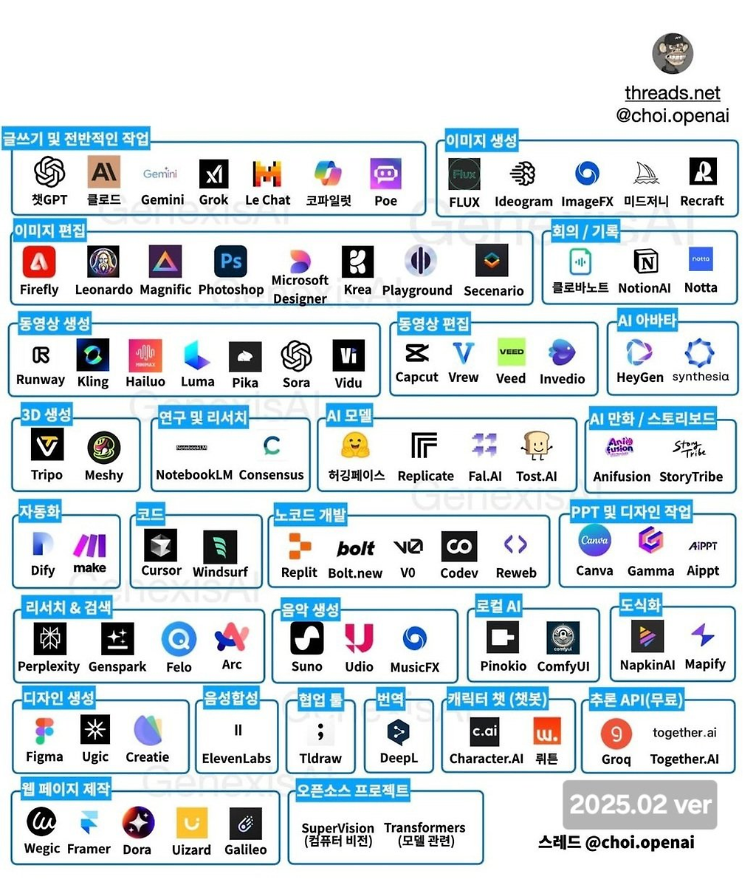

# 2강 업무효율화를 위한 인공지능 서비스

## 1. 인공지능 서비스 고르기

### (1) 어떤 일을 인공지능으로 처리할 것인가?

- 업무를 보다 효율적으로 하기 위해서 인공지능 서비스를 활용하려고 생각했다면 첫번째로 할 일은 어떤 일을 인공지능으로 처리할지 고르는 것이다.
- 우리는 단순히 **일을 한다**고 표현하지만, 우리가 하는 일은 생각보다 다양하고 복잡하다.
- 나의 하루는 수많은 단위과제로 이루어져 있다고 할 수 있을 것이다. 그 중에서 어떤 일을 인공지능으로 처리할 것인지 정해야 한다.
- 기준은 다음과 같다.
  - 첫째, 시간이 많이 필요한 일인가? (또는 반복적으로 수행하는 일인가?)
  - 둘째, 업무 절차가 비교적 일정한가?
  - 셋째, 개인정보 보호 등 정보보안 이슈는 없는가?

- 이 세 가지 조건을 충족하는 일이라면 인공지능 서비스를 활용해 볼만 하다.

### (2) 어떤 인공지능 서비스를 활용할 것인가?

- 다음은 어떤 인공지능 서비스를 사용할 것인지 정해야 한다.
- 인공지능 서비스의 종류는 매우 다양하고, 특성도 다 다르기 때문에 내가 하려는 일에 맞는 인공지능 서비스를 잘 찾는 것도 중요하다.

- 어떤 인공지능 서비스를 써야할지 잘 모르겠다면 ChatGPT 부터 시작하면 된다.
  - ~~ 작업을 하고 싶은데, 인공지능 서비스를 추천해줘

## 2. 음성파일 요약하기

- 어떤 회의나 인터뷰를 녹음하고, 이를 나중에 정리해야 하는 경우가 있다.
- 기존의 방식을 사용한다면 다음과 같은 절차를 거쳐야 한다.
  - ① 녹음한 파일을 들으면서, 말한 사람과 말한 내용을 타이핑한다.
  - ② 타이핑한 내용을 원하는 형태로 요약한다.
 
- 음성파일을 텍스트로 변환하는 것을 Speech To Text, 줄여서 STT 라고 한다.
- "STT 작업을 하려고 하는데, 어떤 인공지능 서비스를 추천해?" 라고 물어보자
- 네이버의 [클로바노트](https://clovanote.naver.com/w/GLXVwjGxFoKcEWyWkniw/home) 서비스를 사용해보자.

- 변환된 텍스트 파일을 원하는 양식으로 요약하는 것은 Gemini 서비스를 사용해보자.

## 3. 자료 검색

- 검색에 특화된 [Perplexity](https://www.perplexity.ai/)가 뛰어난 성능을 보여주지만, 검색을 더 잘하기 위해서는 ChatGPT의 GPT 탐색 메뉴에서 Prompt 생성용 GPTs를 사용하면 도움이 된다.

## 4. 자료 분석

- [NotebookLM](https://notebooklm.google/)을 사용하면 pdf 파일의 내용을 분석할 수 있다.

## 5. 동영상 분석

- [릴리스 ai](https://lilys.ai/) 는 동영상 내용을 요약 정리해 준다.

## 6. PPT 만들기

- [Gamma ai](https://gamma.app/) 는 텍스트를 파워포인트로 변환해 준다.

## 7. 인포그래픽 만들기

- [ChatGPT](https://chatgpt.com/)에서 인포그래픽으로 만들고 싶은 주제를 인포그래픽으로 만들 수 있다.

## 8. 노래 만들기

- [Suno ai](https://suno.com/home) 는 내가 원하는 주제의 노래를 만들어 준다.

## 9. 엑셀, PPT 수정하는 법 배우기

- [Google AI Studio](https://aistudio.google.com/live) 는 내 컴퓨터의 현재 화면을 보면서 나에게 조언을 해 줄 수 있다.
- 엑셀이나 파워포인트에서 원하는 기능을 찾기 어려울 때 사용하면 좋음

